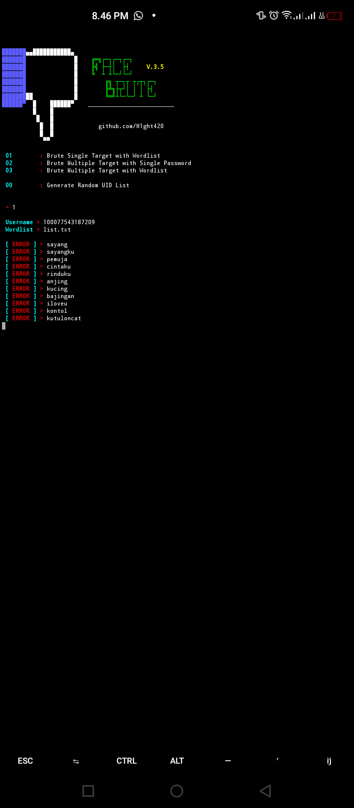

<div align=center>

"

# Tools New For Dedsec 😎
Silahkan Gunakan Tools Ini

## Disclaimer
Tools Ini Hanya Dapat Digunakan Oleh Anggota Kami
yaitu DedSec Community

# Software X Platform
- [x] Termux
- [x] Ubuntu
- [x] Debian
- [x] Linux
- [?] Untuk Centos Dan Tidak ada di daftar Syaa belum coba

# Setup X build
```sh
Penginstalan:
 git clone https://github.com/Razzdedsecc/tools-dedsc
 cd tools-dedsc
 python3 Login.py

FOR TERMUX
  apt update && apt upgrade
  pkg install python2
  pip2 install urllib3 chardet certifi idna requests
  pkg install git
  pip2 install mechanize
  pkg install curl
  pkg install ruby
  pkg install gem
  gem install lolcat
  pkg install git
  pkg install php
  pkg install ruby cowsay toilet figlet
  pkg install neofetch
  pkg install nano
  pip2 install time
  pip2 install sys
  pip2 install os
  
 FOR UBUNTU
  sudo apt update && sudo apt upgrade
  sudo apt install python2
  sudo pip2 install urllib3 chardet certifi idna requests
  sudo apt install git
  sudo pip2 install mechanize
  sudo apt install curl
  sudo apt install ruby
  sudo apt install gem
  sudo gem install lolcat
  sudo apt install git
  sudo apt install php
  sudo apt install ruby cowsay toilet figlet
  sudo apt install neofetch
  sudo apt install nano
  sudo pip2 install time
  sudo pip2 install sys
  sudo pip2 install os

 untuk user & pw Tanyakan ke Owner
 Selamat memakai

Wajib
- Kalian Harus Menginstal bahannya dengan cara pilih line 18
```
## Update Logs
```sh
- Perbaikan masalah
- Penambahan ++
- Bug fix
- Setup Install
```

# CONTACT:
```sh
DEDSec COmmUniTy 
bY Razz#124Z
Update to >>> 1.0.4 Beta
```
